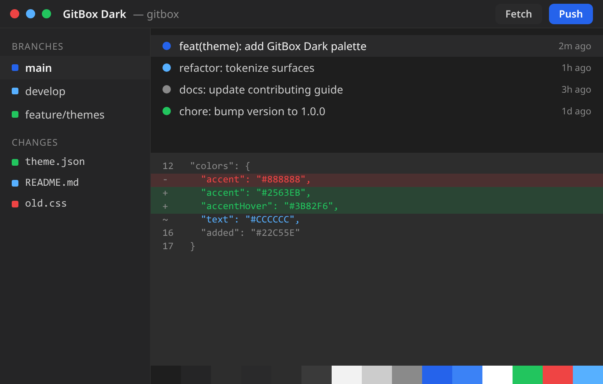
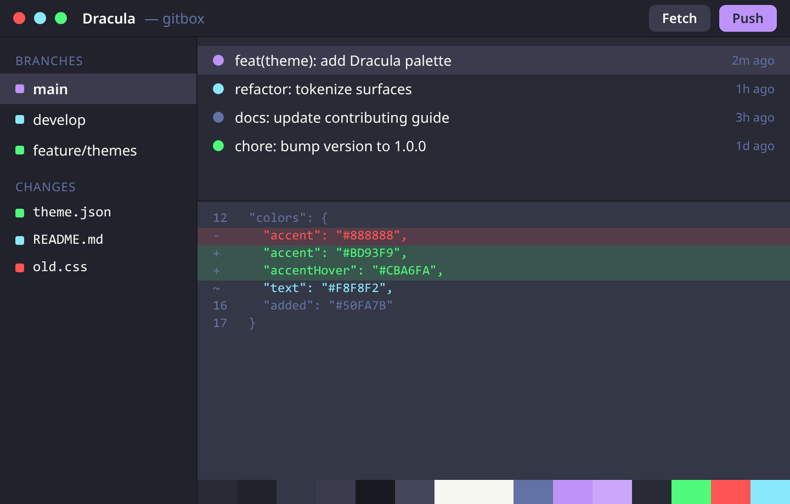
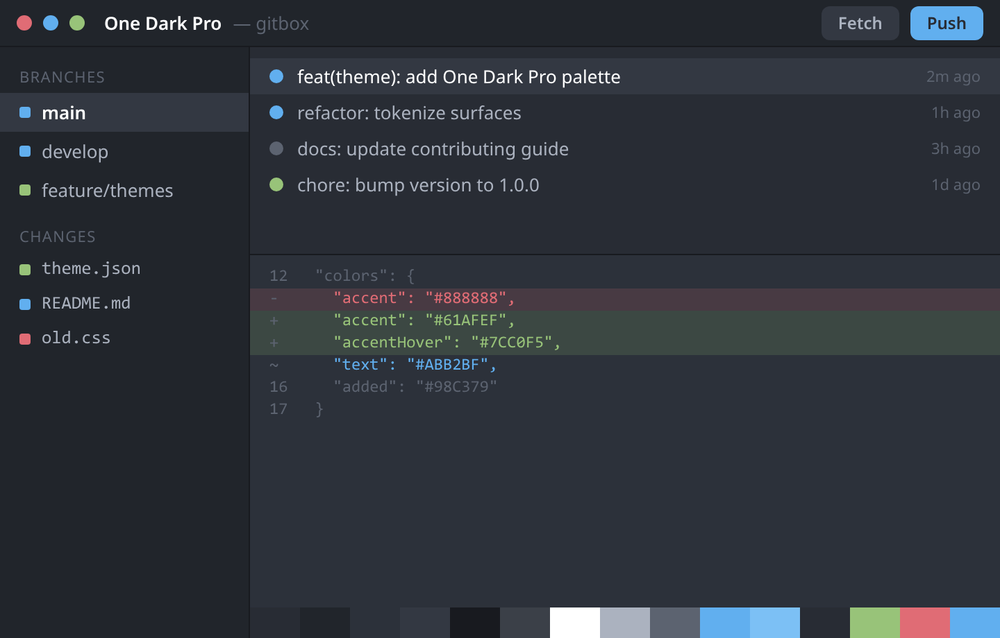
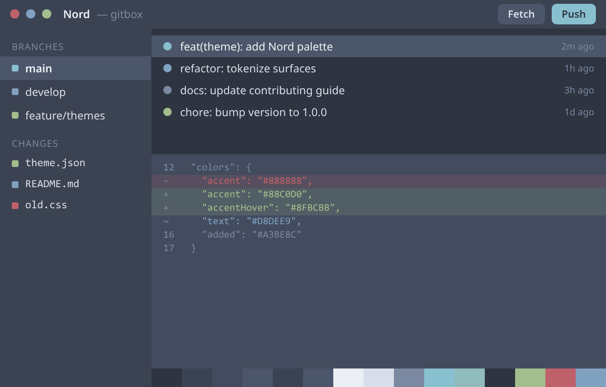
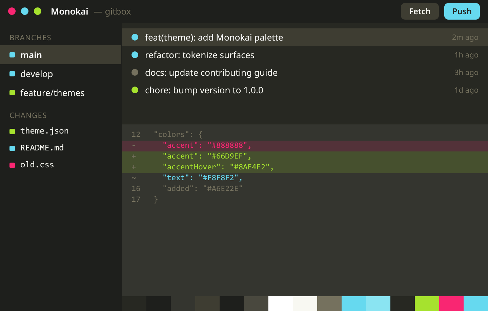
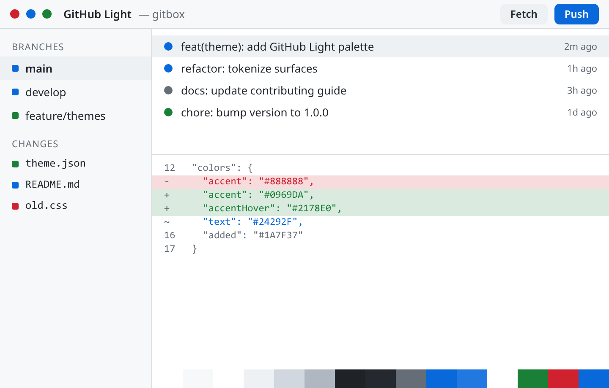

# GitBox Themes

A community registry of themes for [GitBox](https://github.com/gitgusilva/gitbox).
A theme is a single, self-contained JSON file describing the application's color
tokens and typography.

The registry is **folder-driven**: every theme lives in its own folder under
`themes/`, together with its preview image and a short README. There is no index
file to maintain. GitBox discovers themes by listing the `themes/` directory, so
**adding a theme is just adding a folder** — nothing else needs to change for it
to show up in the app's theme repository.

## Gallery

### Dark

<table>
  <tr>
    <td width="50%" align="center" valign="top">
      <a href="themes/gitbox-dark/README.md"></a><br>
      <sub><b>GitBox Dark</b> — GitBox<br><code>themes/gitbox-dark</code></sub>
    </td>
    <td width="50%" align="center" valign="top">
      <a href="themes/dracula/README.md"></a><br>
      <sub><b>Dracula</b> — Dracula Theme<br><code>themes/dracula</code></sub>
    </td>
  </tr>
  <tr>
    <td width="50%" align="center" valign="top">
      <a href="themes/one-dark-pro/README.md"></a><br>
      <sub><b>One Dark Pro</b> — binaryify<br><code>themes/one-dark-pro</code></sub>
    </td>
    <td width="50%" align="center" valign="top">
      <a href="themes/nord/README.md"></a><br>
      <sub><b>Nord</b> — Arctic Ice Studio<br><code>themes/nord</code></sub>
    </td>
  </tr>
  <tr>
    <td width="50%" align="center" valign="top">
      <a href="themes/monokai/README.md"></a><br>
      <sub><b>Monokai</b> — Wimer Hazenberg<br><code>themes/monokai</code></sub>
    </td>
    <td width="50%"></td>
  </tr>
</table>

### Light

<table>
  <tr>
    <td width="50%" align="center" valign="top">
      <a href="themes/gitbox-light/README.md"></a><br>
      <sub><b>GitBox Light</b> — GitBox<br><code>themes/gitbox-light</code></sub>
    </td>
    <td width="50%" align="center" valign="top">
      <a href="themes/solarized-light/README.md"></a><br>
      <sub><b>Solarized Light</b> — Ethan Schoonover<br><code>themes/solarized-light</code></sub>
    </td>
  </tr>
  <tr>
    <td width="50%" align="center" valign="top">
      <a href="themes/github-light/README.md"></a><br>
      <sub><b>GitHub Light</b> — GitHub<br><code>themes/github-light</code></sub>
    </td>
    <td width="50%"></td>
  </tr>
</table>

## Installing a theme

You do not need to clone this repository to use a theme.

**From the app (recommended)**

Open **Settings > Appearance** in GitBox and browse the built-in theme
repository. Every theme in this registry appears there automatically, with a
preview, search, and light/dark filtering. Click **Install** to add one.

**Manual import**

Open the theme you want in the gallery above, download its `theme.json` (or copy
its raw URL), then use **Settings > Appearance > Import** and select the file.

**Programmatically**

List the theme folders through the GitHub contents API and read each
`theme.json` from raw:

```
# list the theme ids
https://api.github.com/repos/gitgusilva/gitbox-themes/contents/themes

# read one theme
https://raw.githubusercontent.com/gitgusilva/gitbox-themes/main/themes/dracula/theme.json
```

## Repository layout

```
gitbox-themes/
  themes/                      One folder per theme, named after the theme id
    dracula/
      theme.json               The theme definition
      README.md                The theme's page (preview + palette)
      preview@2x.png           Retina preview image (1440x920)
    ...
  schema/
    theme.schema.json          JSON Schema (draft-07) every theme must validate against
  scripts/
    validate.mjs               Dependency-free validator for CI and local checks
    gen-previews.mjs           Renders preview@2x.png for each theme (needs Chrome)
  CONTRIBUTING.md              Full contribution rules
  LICENSE
```

## How to submit a theme

Follow these steps to add your theme to the registry. Read
[CONTRIBUTING.md](CONTRIBUTING.md) for the complete rules; the summary below is
enough for most submissions. Submit **one theme per pull request**.

### 1. Design your theme in the app

The easiest way to build a theme is inside GitBox: open
**Settings > Appearance**, edit the colors and typography until you are happy,
then use **Export** to save a `theme.json`. You can also start from an existing
theme's `theme.json` and change the values by hand.

### 2. Pick an id

Choose a unique, lowercase, kebab-case id, for example `solarized-light` or
`tokyo-night`. This id is used for the folder name and the `id` field inside
`theme.json`; the two must match. It must not collide with an existing theme.

### 3. Create the theme folder

Add a new folder `themes/<id>/` containing:

- `theme.json` — your exported theme. Set `id` to your chosen id, and fill in
  `meta.author` (required), `meta.version` (semantic, start at `1.0.0`), and an
  optional `meta.description`.
- `preview@2x.png` — the preview image (see step 5).
- `README.md` — the theme's page (see step 5).

The `theme.json` must define all fifteen color tokens as solid `#RRGGBB` values.
Do not use alpha, `rgb()`, `hsl()`, or named colors; transparency is applied by
the app, never stored in a theme.

There is no index file to edit. The app finds your theme from the folder alone.

### 4. Generate the preview and write the README

Generate the retina preview from your palette (requires Google Chrome or
Chromium):

```
node scripts/gen-previews.mjs <id>
```

This writes `themes/<id>/preview@2x.png`. Then add `themes/<id>/README.md` with,
at minimum, the theme name, the preview image, and a short description. You can
copy the structure of any existing theme's README, for example
[`themes/dracula/README.md`](themes/dracula/README.md).

### 5. Validate

Run the validator and make sure it reports no errors:

```
node scripts/validate.mjs
```

It checks each folder against the schema, the color format, and that every theme
has its `README.md` and `preview@2x.png`. The same check runs in CI on every pull
request.

### 6. Open a pull request

Commit your theme folder and open a pull request. The pull request template
includes a checklist; tick each item. A maintainer reviews the contrast and
palette coherence, and merges once the checks are green.

## Theme format

A theme is a flat object with `id`, `name`, `type`, `colors`, `typography`, and
`meta`.

```json
{
  "id": "dracula",
  "name": "Dracula",
  "type": "dark",
  "meta": {
    "version": "1.0.0",
    "author": "Dracula Theme",
    "authorEmail": "hello@draculatheme.com",
    "description": "A dark theme for the creatures of the night."
  },
  "colors": {
    "bg": "#282A36",
    "bgElevated": "#21222C",
    "bgOverlay": "#343746",
    "surfaceHover": "#3A3C4E",
    "border": "#191A21",
    "borderStrong": "#44475A",
    "textStrong": "#F8F8F2",
    "text": "#F8F8F2",
    "textMuted": "#6272A4",
    "accent": "#BD93F9",
    "accentHover": "#CBA6FA",
    "accentFg": "#282A36",
    "added": "#50FA7B",
    "removed": "#FF5555",
    "modified": "#8BE9FD"
  },
  "typography": {
    "uiFont": "'IBM Plex Sans', 'Segoe UI', system-ui, sans-serif",
    "uiFontSize": 13,
    "monoFont": "'IBM Plex Mono', 'SF Mono', Consolas, monospace",
    "editorFont": "'IBM Plex Mono', 'SF Mono', Consolas, 'Courier New', monospace",
    "editorFontSize": 13,
    "editorLineHeight": 0,
    "radius": 6
  }
}
```

### Color tokens

| Token          | Role                                       |
| -------------- | ------------------------------------------ |
| `bg`           | Base application background                |
| `bgElevated`   | Panels, headers, sidebars                  |
| `bgOverlay`    | Menus, popovers, modals                    |
| `surfaceHover` | Hover background for interactive surfaces  |
| `border`       | Default borders and dividers               |
| `borderStrong` | Emphasized borders                         |
| `textStrong`   | Headings and high-emphasis text            |
| `text`         | Primary text                               |
| `textMuted`    | Secondary and muted text                   |
| `accent`       | Primary action and selection               |
| `accentHover`  | Accent hover state                         |
| `accentFg`     | Foreground drawn on top of `accent`        |
| `added`        | Git added / incoming                       |
| `removed`      | Git removed                                |
| `modified`     | Git modified / current                     |

### Typography

| Field              | Type    | Notes                                     |
| ------------------ | ------- | ----------------------------------------- |
| `uiFont`           | string  | UI font-family stack                      |
| `uiFontSize`       | integer | Base UI font size in px (10-20)           |
| `monoFont`         | string  | Monospace stack for non-editor code       |
| `editorFont`       | string  | Editor font-family stack                  |
| `editorFontSize`   | integer | Editor font size in px (9-24)             |
| `editorLineHeight` | integer | Editor line height in px, `0` = automatic |
| `radius`           | integer | Global corner radius in px (0-20)         |

## Scripts

- `node scripts/validate.mjs` — validate every theme and the registry index.
- `node scripts/gen-previews.mjs [id]` — render `preview@2x.png` for all themes,
  or for a single theme by id. Requires a Chrome or Chromium binary; set
  `CHROME_BIN` if it is not on your `PATH`.

## License

Released under the [MIT License](LICENSE). By contributing a theme you agree to
license it under the same terms. For ports of existing themes, credit the
original author in `meta.author` and note the source in your pull request.
