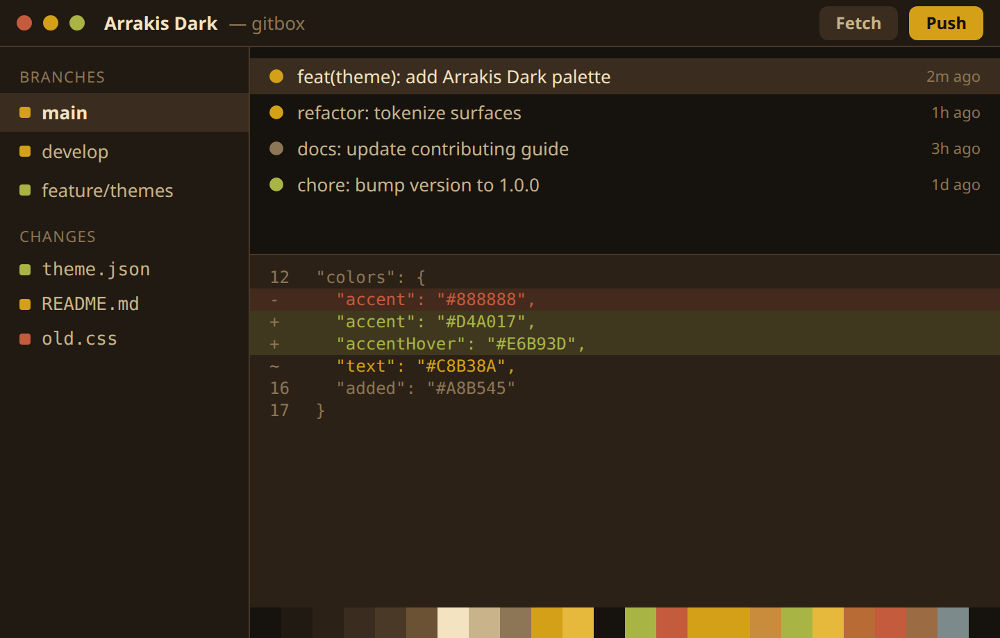

# Arrakis Dark

A desert-inspired dark theme from the sands of Arrakis.



| | |
| --- | --- |
| Type | Dark |
| Author | [Hermes Santos](https://github.com/HermesSantos) |
| Version | 1.0.0 |

## Install

1. Download [`theme.json`](theme.json) from this folder, or copy the raw URL below.
2. In GitBox, open **Settings > Appearance > Import**.
3. Choose the file. The theme is added to your gallery and applied right away.

Raw URL:

```
https://raw.githubusercontent.com/gitgusilva/gitbox-themes/main/themes/arrakis-dark/theme.json
```

## Palette

| Token | Hex | Role |
| --- | --- | --- |
| `bg` | `#16120D` | Base application background |
| `bgElevated` | `#211A12` | Panels, headers, sidebars |
| `bgOverlay` | `#2B2117` | Menus, popovers, modals |
| `surfaceHover` | `#3A2D1F` | Hover background for interactive surfaces |
| `border` | `#4A3927` | Default borders and dividers |
| `borderStrong` | `#6B5234` | Emphasized borders |
| `textStrong` | `#F4E3C1` | Headings and high-emphasis text |
| `text` | `#C8B38A` | Primary text |
| `textMuted` | `#8C7655` | Secondary and muted text |
| `accent` | `#D4A017` | Primary action and selection |
| `accentHover` | `#E6B93D` | Accent hover state |
| `accentFg` | `#16120D` | Foreground drawn on top of the accent |
| `added` | `#A8B545` | Git added / incoming |
| `removed` | `#C45B3C` | Git removed |
| `modified` | `#D4A017` | Git modified / current |

## Typography

| Field | Value |
| --- | --- |
| UI font | `'IBM Plex Sans', 'Segoe UI', system-ui, sans-serif` |
| UI font size | 13px |
| Mono font | `'IBM Plex Mono', 'SF Mono', Consolas, monospace` |
| Editor font | `'IBM Plex Mono', 'SF Mono', Consolas, 'Courier New', monospace` |
| Editor font size | 13px |
| Editor line height | automatic |
| Corner radius | 6px |

## Credits

Created for GitBox by [Hermes Santos](https://github.com/HermesSantos).

---

Back to the [theme registry](../../README.md).
