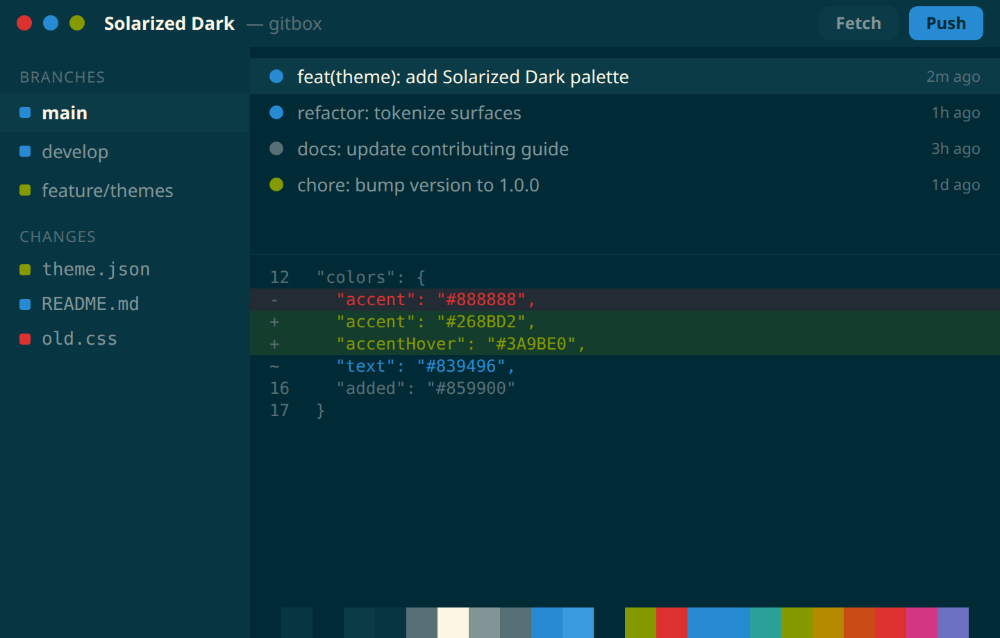

# Solarized Dark

Precision colors for machines and people.



| | |
| --- | --- |
| Type | Dark |
| Author | GitBox |
| Version | 1.0.0 |

## Install

1. Download [`theme.json`](theme.json) from this folder, or copy the raw URL below.
2. In GitBox, open **Settings > Appearance > Import**.
3. Choose the file. The theme is added to your gallery and applied right away.

Raw URL:

```
https://raw.githubusercontent.com/gitgusilva/gitbox-themes/main/themes/solarized-dark/theme.json
```

## Palette

| Token | Hex | Role |
| --- | --- | --- |
| `bg` | `#002B36` | Base application background |
| `bgElevated` | `#073642` | Panels, headers, sidebars |
| `bgOverlay` | `#002B36` | Menus, popovers, modals |
| `surfaceHover` | `#0A3B47` | Hover background for interactive surfaces |
| `border` | `#073642` | Default borders and dividers |
| `borderStrong` | `#586E75` | Emphasized borders |
| `textStrong` | `#FDF6E3` | Headings and high-emphasis text |
| `text` | `#839496` | Primary text |
| `textMuted` | `#586E75` | Secondary and muted text |
| `accent` | `#268BD2` | Primary action and selection |
| `accentHover` | `#3A9BE0` | Accent hover state |
| `accentFg` | `#002B36` | Foreground drawn on top of the accent |
| `added` | `#859900` | Git added / incoming |
| `removed` | `#DC322F` | Git removed |
| `modified` | `#268BD2` | Git modified / current |

## Typography

| Field | Value |
| --- | --- |
| UI font | `'IBM Plex Sans', 'Segoe UI', system-ui, sans-serif` |
| UI font size | 13px |
| Mono font | `'IBM Plex Mono', 'SF Mono', Consolas, monospace` |
| Editor font | `'IBM Plex Mono', 'SF Mono', Consolas, 'Courier New', monospace` |
| Editor font size | 13px |
| Editor line height | automatic |
| Corner radius | 6px |

## Credits

Part of the default GitBox theme set.

---

Back to the [theme registry](../../README.md).
